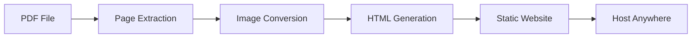

# PDF Flipbook Animator

Convert PDFs to animated flipbook web pages with beautiful page-turning effects.

## Features

✨ **Easy to Use** - Simple CLI interface with sensible defaults  
📄 **High Quality** - Converts PDFs to optimized WebP images  
� **3 Animation Modes** - Simple, 3D CSS, or realistic page curl (StPageFlip)  
🔗 **Clickable Links** - Preserves internal navigation and external URLs (`--preserve-links`)  
📑 **Table of Contents** - Searchable, collapsible TOC sidebar from PDF bookmarks (`--enable-toc`)  
🔍 **Zoom & Pan** - Scroll-wheel zoom with click-and-drag panning  
🎨 **Customizable** - Control colors, DPI, quality, and more  
📱 **Responsive** - Works beautifully on desktop, tablet, and mobile  
⚡ **Fast** - Lazy loading and efficient image optimization  
🌐 **Host Anywhere** - Generates static HTML that works on any web server  
🎯 **Keyboard Navigation** - Arrow keys, Page Up/Down, Home/End support  
🖥️ **Fullscreen Mode** - Immersive reading experience  
💾 **Position Memory** - Remembers where you left off  
💻 **Windows Executable** - No Python installation needed

## Quick Start

### Installation

```bash
pip install pdf-flipbook-animator
```

### Basic Usage

Convert a PDF to a flipbook:

```bash
pdf-flipbook convert your-document.pdf
```

This creates a complete website in `output/your-document/` that you can:

- Open directly in your browser
- Upload to any web hosting service
- Share with anyone

### Example

```bash
# Convert with custom options
pdf-flipbook convert book.pdf \
    --output-dir ./my-flipbook \
    --dpi 200 \
    --title "My Amazing Book" \
    --primary-color "#FF5722"

# Batch convert multiple PDFs
pdf-flipbook batch ./pdf-folder/ --dpi 150

# Get PDF information
pdf-flipbook info document.pdf
```

## How It Works

1. **PDF Extraction**: Reads your PDF and extracts each page
2. **Image Conversion**: Converts pages to optimized WebP images (with JPG fallback)
3. **HTML Generation**: Creates a beautiful interactive viewer
4. **Ready to Host**: Output is a self-contained folder ready for deployment



## Output Structure

```
output/your-document/
├── index.html          # Main viewer page
├── css/
│   └── style.css       # Styling
├── js/
│   └── flipbook.js     # Interactive logic
└── images/
    ├── page_001.webp   # WebP images
    ├── page_002.webp
    └── fallback/       # JPG fallbacks
        ├── page_001.jpg
        └── page_002.jpg
```

## Demo

[🔗 View Live Demo](https://vedanttalnikar.github.io/pdf-flipbook-animator-commercial/)

!!! example "Try It Out"
    ```bash
    # Download example PDF
    wget https://example.com/sample.pdf
    
    # Convert it
    pdf-flipbook convert sample.pdf
    
    # Open in browser
    open output/sample/index.html
    ```

## Key Technologies

- **PyMuPDF**: High-quality PDF rendering
- **Pillow**: Image processing and optimization
- **WebP**: Modern image format for 30% smaller files
- **Vanilla JavaScript**: No frameworks, fast and lightweight

## Browser Support

- ✅ Chrome/Edge (latest)
- ✅ Firefox (latest)
- ✅ Safari (latest)
- ✅ Mobile browsers (iOS Safari, Chrome Mobile)

## Use Cases

- 📚 **Digital Publishing** - Magazine-style presentations
- 📖 **Documentation** - Interactive manuals and guides
- 🎓 **Education** - Course materials and textbooks
- 📊 **Reports** - Annual reports and portfolios
- 🎨 **Portfolios** - Design work and photo books

## Requirements

- Python 3.9 or higher
- Modern web browser

## License

MIT License - see [LICENSE](https://github.com/vedanttalnikar/pdf-flipbook-animator-commercial/blob/main/LICENSE)

## Contributing

Contributions are welcome! See [CONTRIBUTING.md](contributing.md) for guidelines.

## Support

- � Email: vedanttalnikar@gmail.com
- �📖 [Documentation](https://vedanttalnikar.github.io/pdf-flipbook-animator-commercial)
- 🐛 [Issue Tracker](https://github.com/vedanttalnikar/pdf-flipbook-animator-commercial/issues)
- 💬 [Discussions](https://github.com/vedanttalnikar/pdf-flipbook-animator-commercial/discussions)

## Acknowledgments

- [PyMuPDF](https://pymupdf.readthedocs.io/) for excellent PDF processing
- [Pillow](https://python-pillow.org/) for image manipulation
- [Material for MkDocs](https://squidfunk.github.io/mkdocs-material/) for beautiful docs

---

Made with ❤️ by the PDF Flipbook Animator community
